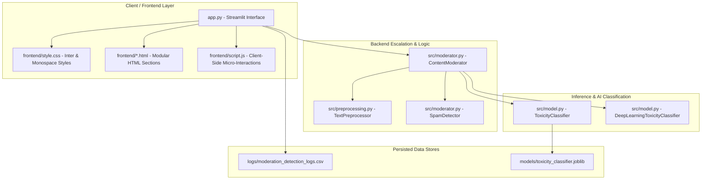

# Technical Architecture Document: Toxic Comment Moderation System

This document provides a comprehensive technical overview of the high-precision **Toxic Comment Moderation & Lobby Simulator** system. It details the modular design, structural breakdown, data pipelines, threshold optimization algorithms, and the decoupling of the frontend user interface from the backend core analytics.

---

## 🗺️ Overall System Architecture

The project is structured around a decoupled model where the machine learning pipelines and real-time moderation engines are maintained in modular python libraries, while the frontend visual console is rendered dynamically.



---

## 📁 Folder Structure

Below is the directory mapping of the refactored project showing the strict separation of concerns:

```
.
├── Instructions.md              # Project prompt requirements and specifications
├── README.md                    # Core developer onboarding guide
├── app.py                       # Main application runtime and Streamlit controller
├── train.py                     # Training script to build the ML multi-label model
├── generate_logs.py             # Script to generate synthetic logs and seed files
├── zip_submission.py            # Automated archive tool for submission zip
├── architecture.md              # [This File] Complete system architecture details
│
├── frontend/                    # Decoupled Presentation Assets
│   ├── style.css                # Forced Dark-Mode theme, typography, & keyframes
│   ├── script.js                # Client-side validation & micro-interactions
│   ├── header.html              # Main Hero section containing semantic title
│   ├── chat_header.html         # Tab 1 Live Ingestion column header
│   ├── directory_header.html    # Tab 1 Active Directory column header
│   ├── analytics_header.html    # Tab 2 Analytics Event Dashboard header
│   ├── policy_header.html       # Tab 3 Mitigation Escalation Matrix header
│   └── key_features.html        # Tab 3 System Key Features list
│
├── src/                         # Core Machine Learning & Moderation Logic
│   ├── __init__.py              # Package initialization
│   ├── data_loader.py           # Multi-repo downloader for HF Jigsaw dataset
│   ├── model.py                 # Multi-label TF-IDF + Logistic Regression & BERT wrappers
│   ├── moderator.py             # ContentModerator, SpamDetector, and Redaction logic
│   └── preprocessing.py         # Normalizer, slang translator, contraction expander
│
├── models/                      # Trained Model Binaries
│   └── toxicity_classifier.joblib # Serialized classical multi-label model
│
├── logs/                        # Volatile & Session Analytics Storage
│   ├── moderation_detection_logs.csv
│   └── sample_chat_logs.csv
│
└── artifacts/                   # Plot figures and static documentation matrices
    ├── evaluation_metrics.png
    ├── label_correlations.png
    └── toxic_comment_moderator_walkthrough.md
```

---

## ⚙️ Purpose of Each File & Module

### 1. Presentation Layer (`frontend/`)
* **`style.css`**: Consolidates 100% of the style declarations, custom scrollbars, typography settings (`Inter`, `JetBrains Mono`), pulsating dots keyframe configurations (`pulse-dot-active`), and tag classes.
* **`script.js`**: Houses browser micro-interactions and terminal output console checks.
* **`header.html`, `chat_header.html`, `directory_header.html`, `analytics_header.html`, `policy_header.html`, `key_features.html`**: Completely decouples structural HTML templates from the application scripting, making it trivial to alter layouts or SEO elements.

### 2. Core Backend Modules (`src/`)
* **`preprocessing.py`**:
  * Demojizes emojis to extract literal semantic expressions (e.g. 🖕 ➔ `:middle_finger:`).
  * Standardizes casings and expands general English contractions (e.g. *you're* ➔ *you are*).
  * Translates game slang into clean literal vectors (e.g. *kys* ➔ *kill yourself*, *ez* ➔ *easy*).
* **`model.py`**:
  * **`ToxicityClassifier`**: Classical TF-IDF Vectorizer (n-grams 1-2, 25,000 features) coupled with a `MultiOutputClassifier` mapping independent `LogisticRegression` estimators for each of the 6 classes (`toxic`, `severe_toxic`, `obscene`, `threat`, `insult`, `identity_hate`). Handles automatic target precision optimization via iterative threshold sweeps.
  * **`DeepLearningToxicityClassifier`**: Lazy-loading transformer block utilizing the Hugging Face Pipeline API to load `unitary/toxic-bert` for sub-second, highly generalizable contextual deep learning checks.
* **`moderator.py`**:
  * **`SpamDetector`**: Conducts link/URL inspection, caps ratio evaluation, repeating token audits, and message frequency speed tests (checking for rapid floods, defined as 3 messages in under 2.5 seconds).
  * **`ContentModerator`**: Acts as the central pipeline orchestrator. Aggregates multi-label probability coefficients, assigns weights, determines global severity scores (0.0 to 5.0), censors profane keywords locally, and triggers action dispatches (`ALLOW`, `WARN`, `MUTE`, `BAN`).
* **`data_loader.py`**:
  * Implements a resilient Hugging Face repository downloader that checks multiple sources for Jigsaw dataset chunks, falling back to a gaming-specific synthetic dataset generator if local networks are offline.

### 3. Pipeline Controls
* **`app.py`**: The Streamlit driver. Initializes session states, controls sidebar sliders, hosts model configurations, and binds the presentation components with the backend analytical predictions.
* **`train.py`**: Executes training and triggers validation reporting.

---

## ⚡ Frontend-Backend Communication Flow

1. **User Interaction**: The client triggers actions either by submitting chat text in the Streamlit `st.chat_input` box or by clicking the `Sim Player Message` button in the simulator tab.
2. **Real-time Event Ingestion**: Streamlit intercepts the input event and routes the raw text to the instantiated `ContentModerator` singleton.
3. **Multi-Stage Processing**:
   * The text is preprocessed inside `TextPreprocessor.preprocess()` to expand abbreviations.
   * `SpamDetector` executes quick structural heuristic calculations on the original layout.
   * Based on the selected model selector, either classical vectorizer models or transformer models compute probability matrices.
4. **Aggregation & Redaction**: The severity index is derived, moderation limits are checked, and profane matches are redacted to output safe text blocks.
5. **Dynamic UI Rendering**: Streamlit receives the analytical payload and merges it with HTML layouts loaded from the `frontend/` directory, updating the client's screen reactive layout instantly.

---

## 💾 Database Interactions

The current configuration is a decoupled developer sandboxed system:
* **Session State**: Volatile session details (chat streams, active player listings, evaluation latency arrays) are hosted in local server RAM via `st.session_state` to prevent latency.
* **CSV Logging**: Validated event records and infraction dispatches are stored persistently inside `logs/moderation_detection_logs.csv` for audit trails.

---

## 🔌 API Routes & Responsibilities

Streamlit handles interactive routing on a single websocket connection. Custom states coordinate navigation across the virtual tabs:
1. **Live Chat Simulator Tab (`tab_simulator`)**: Real-time simulation portal for chat input and player active directory tracking.
2. **Admin Analytics Dashboard Tab (`tab_analytics`)**: Telemetry charts displaying timeline hazard fluctuations, active violation distribution bar charts, and data tables.
3. **Mitigation Strategies Tab (`tab_policy`)**: Administrative overview mapping out standard operating severity limits, legal targets, and automation parameters.

---

## 📦 Dependencies & Interactions

The system leverages a modern ML stack:
* **`streamlit`**: Binds Python data vectors to the interactive browser views.
* **`scikit-learn`**: Drives TF-IDF feature extraction and Logistic Regression classification.
* **`transformers`**: Connects PyTorch sequence classification layers to tokenized inputs for BERT predictions.
* **`matplotlib` & `seaborn`**: Build visual analytics graphs.
* **`pandas` & `numpy`**: Perform multi-dimensional array operations.
* **`emoji`**: Demojizes glyph strings.
